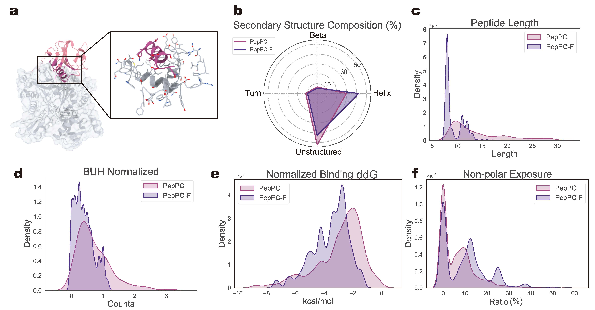

# PepPC-F and PepPC Datasets for DiffPepBuilder

This repository provides information on PepPC-F and PepPC datasets for the paper [Target-Specific De Novo Peptide Binder Design with DiffPepBuilder](https://arxiv.org/abs/2405.00128).



For any questions, please open an [issue](https://github.com/YuzheWangPKU/DiffPepBuilder/issues) or contact wangyuzhe_ccme@pku.edu.cn for more information.

## PepPC-F Dataset

The contents of PepPC-F dataset (synthetic protein-protein fragment complex dataset) are provided in the file [PepPC-F_dataset.csv](PepPC-F_dataset.csv). To obtain the raw data from [Zenodo](https://zenodo.org/records/13744402), you can use the following command:

```bash
wget https://zenodo.org/records/13744402/files/PepPC-F_raw_data.tar.gz
```

## PepPC Dataset

The contents of PepPC dataset (natural protein-peptide complex dataset) are provided in the file [PepPC_dataset.csv](PepPC_dataset.csv). To obtain the raw data from [Zenodo](https://zenodo.org/records/13744402), you can use the following command:

```bash
wget https://zenodo.org/records/13744402/files/PepPC_raw_data.gz
```